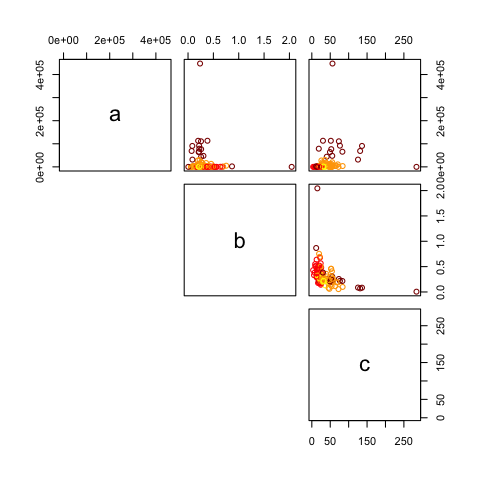

```{r setup, include=FALSE}
knitr::opts_chunk$set(echo = TRUE)

library(tidyverse)
require(drc)
```

### Introduction

COVID-19 is currently the world's largest public health crisis. One of the many challenges presented by the pandemic has been the ability to understand and predict the trajectory of disease. Being able to estimate values such as expected total cases and fatalities, greatly affects a nation's decision to combat the disease and prepare their healthcare systems. Furthermore, the effect of the virus is varied in different countries and regions, thus requiring different predictions to assist in making more local decisions.

The logistic growth curve has been traditionally applied to model epidemics and disease data. In the early days of disease, the growth is exponential but then slows as the population is exposed and begins to develop immunity. This curve is characterized by three parameters:  the upper bounder (maximum number of cases), growth rate, and the mid-point (when the spread of disease begins to slow). We propose using the Newton Raphson algorithm on a logistic growth curve model to predict these parameters for different countries. Furthermore, we use these predicted parameters to group countries to further understand the factors playing a role in the growth curve of the disease and advise on countries with similar trajectories. 

### Methods

#### Predicting disease trajectory

For the three-parameter logistic growth function, we can use least squares method to estimate the parameters a, b, and c. We define the objective function as the residual sum of squares and we can utilize Newton Raphson to find the optimal values that minimize this function. 

The objective function is 
$$f(\theta) = \cfrac{1}{2}\sum_{i = 1}^n \big[y_i - \mu_i(t_i, \theta)\big]^2,\ where \ \mu_i(t_i, \theta) = \cfrac{a}{1 + e^{-b(t -c)}}$$

The gradient can be defined as

$$\nabla f(\theta) = \sum_{i = 1}^n \big[y_i - \mu_i(t_i, \theta)\big] \nabla \mu_i (t_i, \theta) =
\left(\begin{array}{c} -\sum_{i=1}^{n} \bigg(y_{i}-\cfrac{a}{1 + e^{-b(t_i -c)}}\bigg) \cfrac{1}{1 + e^{-b(t_i -c)}} \\
\sum_{i=1}^{n} \bigg(y_{i}-\cfrac{a}{1 + e^{-b(t_i -c)}}\bigg) \cfrac{a(c-t_i)e^{-b(t_i - c)}}{(1 + e^{-b(t_i -c)})^2} \\
\sum_{i=1}^{n} \bigg(y_{i}-\cfrac{a}{1 + e^{-b(t_i -c)}}\bigg) \cfrac{abe^{-b(t_i - c)}}{(1 + e^{-b(t_i -c)})^2} \end{array}\right) $$


The hessian can be expressed as 

$$\nabla^2 f(\theta) = \sum_{i = 1}^n \nabla \mu_i(t_i, \theta) [\mu_i(t_i, \theta)]^T - \sum_{i = 1}^n [y_i - \mu_i(t_i, \theta)][\nabla^2\mu(t_i, \theta)]^T$$

Newton Raphson is a method to search for solutions to the system of equations $\nabla f(\theta) = 0$. Using an approximation of the gradient, we obtain 

$$
\nabla f(\boldsymbol{\theta}) = 
\nabla f\left(\boldsymbol{\theta}_{0}\right)+\nabla^{2} f\left(\boldsymbol{\theta}_{0}\right)\left(\boldsymbol{\theta}-\boldsymbol{\theta}_{0}\right)=\mathbf{0}
$$

Rearranging the equation above, we find that Newton Raphson updates the parameters at the $i^{th}$ step using

$$
\boldsymbol{\theta}_{i}=\boldsymbol{\theta}_{i-1}-\left[\nabla^{2} f\left(\boldsymbol{\theta}_{i-1}\right)\right]^{-1} \nabla f\left(\boldsymbol{\theta}_{i-1}\right)
$$

However due to the complexicity of the Hessian matrix, we choose to use the identity matrix as a replacement. Although it requires more iterations in order to converge, the identity matrix simplifies the algorithm because it does not have to calculate the inverse of the hessian matrix. Since the identity matrix is positive definite, Newton's direction $d = - [\nabla^2 f(\theta_0)]^{-1}\nabla f(\theta_0) = - [-I]\nabla f(\theta_0)$ will always be in an ascent direction. Now, we update the parameters using

$$
 \boldsymbol{\beta}_{1}=\boldsymbol{\beta}_{0}+I_{3 \times 3} \nabla f\left(\boldsymbol{\beta}_{0}\right)
$$

In addition, we incorporate step halving to ensure that the algorithm moves a specific distance along the ascent direction so that the objective function increases. At the $i^{th}$ step, if $f(\theta_i) > f(\theta_{i+1})$, then we proceed to step $i + 1$. Othersiwe, we search for a value $\lambda \in (1, 1)$ until $f(\theta_i(\lambda)) > f(\theta_i)$ then proceed to step $i + 1$

#### Clustering for Risk Factors

**K-means Clustering**

It is of interest to public health experts to see which countries are having similar trends in the COVID-19 outbreak in order to help further understand how the disease is spread. We use the K-mean clustering algorithm to cluster the countries into groups based on the three parameters (a, b and c) estimated. This algorithm requires one to pre-specify the number of clusters one wishes to group the observations into. It then aims to minimize the within cluster correlation.
 
To begin this minimization process, K observations are randomly chosen and their observed predictors values are used to initiate the centroid for each cluster. The K centroids will be p dimensional, where p is the dimension of the variables given to the algorithm to create the clusters. In our case p = 3 ($\hat{a}$, $\hat{b}$, and $\hat{c}$). Each observation is then assigned to the cluster for which it has the smallest distance to the centroid. We chose to use Euclidian distance, such that the distance to the centroid of each cluster per observation is measured as $\sum_{j=1}^p(x_{ij}-\bar{x}_{j})^2$ for observation i (i = 1,...,n). The centroid for the $k^{th}$ cluster is then recomputed as the p averages of the observations in each cluster. These steps are repeated until the clusters stop changing. 

**Gaussian Mixture Model**

A second method, the Gaussian Mixture Model (GMM), was applied using EM algorithm to cluster the fitted parameters. The EM algorithm allows for maximizing the likelihood function when some of the variables are unobserved. In this case unobserved variable would refer to the clusters. Since this is a GMM, the parameters are assumed to follow a multivariate normal distribution with mean $\mu$ and covariance matrix $\sum$. 

In the algorithm, the first step is the Expectation step in which the probability of being in a cluter given the current data is calculated. The expectation can be represented as follows:
$$E[Z_i=1|x_i, \theta^{(t)}]=P(Z_i=1|x_i, \theta^{(t)}) = \frac{p^{(t)}f(x_i, \mu^{(t)}_2, \sum^{(t)}_2)}{(1-p^{(t)})f(x_i, \mu^{(t)}_1, \sum^{(t)}_1)+p^{(t)}f(x_i, \mu^{(t)}_2, \sum^{(t)}_2)}$$
with $Z_i$ indicating the cluster. So if $Z_i=1$ then $X_i$ would be from the $MVN(\mu_2, \sum_2)$ distribution. For the initiation, the results of the K-means clustering was used as the starting values for the weights, means, and covariance matrices.


The second step is the Maximizing step wherein the likelihood function is maximized to update the parameters. More specificaly, the cluster probabilities (i.e. the weight signifiying how much each cluster represents the data points), cluster means, and cluster covariance matrices will be updated. The equations for the parameters are as follows:

$$p^{(t+1)}=\frac{\sum Z_i}{N}$$
$$\mu^{(t+1)}_1=\frac{\sum^n_{i=1}(1-Z_i^t)X_i}{\sum^n_{i=1}(1-Z_i^t)}$$
$$\mu^{(t+1)}_1=\frac{\sum^n_{i=1}Z_i^{(t)}X_i}{\sum^n_{i=1}Z_i^{(t)}}$$

$$\sigma_1^{2(t+1)}=\frac{\sum^n_{i=1}[(1-Z_i^{(t)})(X_i-\mu_1^{(t+1)})^2]}{\sum^n_{i=1}(1-Z_i^{(t)})}$$

$$\sigma_2^{2(t+1)}=\frac{\sum^n_{i=1}[Z_i^{(t)}(X_i-\mu_2^{(t+1)})^2]}{\sum^n_{i=1}Z_i^{(t)}}$$


These two steps are repeated iteratively until the parameters converge (change less than 0.00001) or the max number of iterations is reached. The algorithm also works for different number of clusters at which point we will have working weights for each cluster from 1 to k clusters. However, since the algorithm incorporates the results of the K-means function as starting values for the parameters, some issues arose in instances when there was only one observation for a cluster. This would lead to sigma matrices being zero. Therefore, when this occurred, we removed the sole country in the cluster and ran the algorithm again. 


### Results

#### Parameter Predictions

Figure 1 shows the estimated logistic growth curves from countries estimated to have more than 50,000 confirmed cases. Israel stands out as having both a relative steep slope as well as its high number of estimated cases. Taiwan and Singapore are included in the plot because their estimated total cases is greater than 50,000, but within a 100 days they never reach this peak because the growth rate is so small. 

In total, 63 countries had already passed their estimated midpoints of the disease. These countries included Italy (c = 51.7), Iran (c = 25.9), Germany (c = 55.5), and Spain (c = 52.7) which are all locations of large outbreaks. The remaining 46 countries had yet to reach or were approaching their disease peaks. This included the United States which were just approaching their estimated midpoint (c = 30.3). Nepal was estimated to have the longest time to disease peak (c = 284.2) while the Maldives were estimated to have the shortest time to disease peak (c = 3.56). Only Togo had a growth rate greater than 1 (b = 2.04). The next largest growth rates belong to Turkey (b = 0.867) and Cote d'Ivoire (b = 0.751). Nepal had the lowest growth rate (b = 0.00595) followed by the Vatican City (0.056).

We compared our prediction results, which were modelled on data prior to March 23, with the most recent data (up to April __). Figures 2 through 6 show estimated growth curves plotted with the actual disease trajectories from Italy, the US, Israel, Togo, and Nepal. Our models closely follow the convex curves, where disease trajectories are exponentially increasing in the first few weeks. However, they diverge drastically after the first few weeks. We underpredicted the total confirmed cases in Italy, the US, Togo, and Nepal and overpredicted for Israel. The true growth rate for the US, Togo, and Nepal were also much higher than what our models predicted. Italy's curve, though not accurate, is more close to the the actual data than our other predictions. This is likely the result of there being more quality data available, as Italy had been an epicenter of the disease for quite awhile by the time our data was collected.

#### Clustering

We have estimated logistic growth curves for 109 countries. We explored different clustering values using K-means clustering and found that for k = 2, 98 observations were placed in cluster 1 and 11 observations were placed in cluster 2 while for k = 3, the observations were divided into 1, 12, and 96 observations per cluster and k = 4 into 1, 9, 10, and 98 observations per cluster. Due to it's high estimated upper bound ($\hat{a}$) Israel was constantly placed in its own cluster. We chose to focus on four clusters. Figure 2 shows the correlation amongst the four clusters across the three parameters. We see $\hat{a}$ was a driving factor in the cluster formation. The formation can be mostly described as very high estimated upper bound (only Israel), high upper bound (purple), middle upper bound (red), and low upper bound (blue). The majority of countries fall in the low upper bound group. Figure 3 shows the clusters across a map, with labels given to the countries shown in Figure 1 with $/hat(a)$ > 50,0000. We see these countries are all clustered in the same cluster (except for Isael). This includes the countries with the higest cases globally (USA, Spain and Italy). 


Using the GMM EM algorithm for k=2 clusters, the results showed that 78 observations were placed in cluster 1 while the remaining 31 observations were in cluster 2. For k=3, clusters 1, 2, and 3 had 59, 19, and 30 observations, respectively. While for k=4, clusters 1, 2, 3, and 4 had 60, 4, 12, and 32 observations, respectively. Similar clustering was observed to the K-means results. More specifically, the clustering seemed to be defined by the upper bound from very high, to high, to middle, and to low. Most of the countries were placed in the low upper bound cluster. Notable countries such as the US and China with high max number of cases a region can reach were found in the very high upper bound cluster.


## Discussion


## Appendix

*Figure 1.*

```{r fig1,  echo=FALSE, fig.align='center'}
knitr::include_graphics('./growth_curves1.jpeg')
```

*Figure 2.*

```{r fig2,  echo=FALSE, fig.align='center'}

```

*Figure 3.*

```{r fig3,  echo=FALSE, fig.align='center'}
knitr::include_graphics('./us_predicted_cases.jpeg')
```

*Figure 4.*

```{r fig4,  echo=FALSE, fig.align='center'}
knitr::include_graphics('./israel_prediction_cases.jpeg')
```

*Figure 5.*

```{r fig5,  echo=FALSE, fig.align='center'}

```

*Figure 6.*

```{r fig6,  echo=FALSE, fig.align='center'}
knitr::include_graphics('./nepal_prediction_cases.jpeg')
```

*Figure 7. k = 4 clusters scatter plots for three parameters*

```{r fig7, echo = FALSE, fig.align='center', out.width = "50%", dpi = 72}
knitr::include_graphics('./kmeans_plot.png')
```


*Figure 8.*

```{r fig8, echo = FALSE, fig.align='center', out.width = "90%"}
knitr::include_graphics('./gkmeans_map.png')
```

*Figure 9.*

```{r fig9, echo = FALSE, fig.align='center', out.width = "90%"}

```


*Figure 10.*

```{r fig10, echo = FALSE, fig.align='center', out.width = "90%"}
knitr::include_graphics('./gmm_map.png')
```


