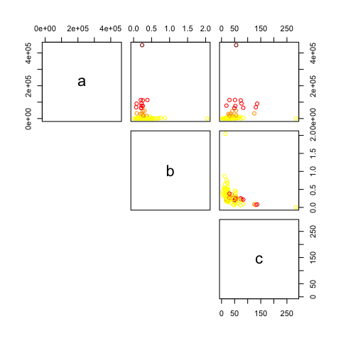

```{r setup, include=FALSE}
knitr::opts_chunk$set(echo = TRUE)

library(tidyverse)
require(drc)
```

### Introduction

COVID-19 is currently the world's largest public health crisis. One of the many challenges presented by the pandemic has been the ability to understand and predict the trajectory of disease. Being able to estimate values such as expected total cases and fatalities, greatly affects a nation's decision to combat the disease and prepare their healthcare systems. Furthermore, the effect of the virus is varied in different countries and regions, thus requiring different predictions to assist in making more local decisions.

The logistic growth curve has been traditionally applied to model epidemics and disease data. In the early days of disease, the growth is exponential but then slows as the population is exposed and begins to develop immunity. This curve is characterized by three parameters:  the upper bounder (maximum number of cases), growth rate, and the mid-point (when the spread of disease begins to slow). We propose using the Newton Raphson algorithm on a logistic growth curve model to predict these parameters for different countries. Furthermore, we use these predicted parameters to group countries to further understand the factors playing a role in the growth curve of the disease and advise on countries with similar trajectories. 

### Methods

#### Predicting disease trajectory

For the three-parameter logistic growth function, we can use least squares method to estimate the parameters a, b, and c. We define the objective function as the residual sum of squares and we can utilize Newton Raphson to find the optimal values that minimize this function. 

The objective function is 
$$f(\theta) = \cfrac{1}{2}\sum_{i = 1}^n \big[y_i - \mu_i(t_i, \theta)\big]^2,\ where \ \mu_i(t_i, \theta) = \cfrac{a}{1 + e^{-b(t -c)}}$$

The gradient can be defined as

$$\nabla f(\theta) = \sum_{i = 1}^n \big[y_i - \mu_i(t_i, \theta)\big] \nabla \mu_i (t_i, \theta) =
\left(\begin{array}{c} -\sum_{i=1}^{n} \bigg(y_{i}-\cfrac{a}{1 + e^{-b(t_i -c)}}\bigg) \cfrac{1}{1 + e^{-b(t_i -c)}} \\
\sum_{i=1}^{n} \bigg(y_{i}-\cfrac{a}{1 + e^{-b(t_i -c)}}\bigg) \cfrac{a(c-t_i)e^{-b(t_i - c)}}{(1 + e^{-b(t_i -c)})^2} \\
\sum_{i=1}^{n} \bigg(y_{i}-\cfrac{a}{1 + e^{-b(t_i -c)}}\bigg) \cfrac{abe^{-b(t_i - c)}}{(1 + e^{-b(t_i -c)})^2} \end{array}\right) $$


The hessian can be expressed as 

$$\nabla^2 f(\theta) = \sum_{i = 1}^n \nabla \mu_i(t_i, \theta) [\mu_i(t_i, \theta)]^T - \sum_{i = 1}^n [y_i - \mu_i(t_i, \theta)][\nabla^2\mu(t_i, \theta)]^T$$

Newton Raphson is a method to search for solutions to the system of equations $\nabla f(\theta) = 0$. Using an approximation of the gradient, we obtain 

$$
\nabla f(\boldsymbol{\theta}) = 
\nabla f\left(\boldsymbol{\theta}_{0}\right)+\nabla^{2} f\left(\boldsymbol{\theta}_{0}\right)\left(\boldsymbol{\theta}-\boldsymbol{\theta}_{0}\right)=\mathbf{0}
$$

Rearranging the equation above, we find that Newton Raphson updates the parameters at the $i^{th}$ step using

$$
\boldsymbol{\theta}_{i}=\boldsymbol{\theta}_{i-1}-\left[\nabla^{2} f\left(\boldsymbol{\theta}_{i-1}\right)\right]^{-1} \nabla f\left(\boldsymbol{\theta}_{i-1}\right)
$$

However due to the complexicity of the Hessian matrix, we choose to use the identity matrix as a replacement. Although it requires more iterations in order to converge, the identity matrix simplifies the algorithm because it does not have to calculate the inverse of the hessian matrix. Since the identity matrix is positive definite, Newton's direction $d = - [\nabla^2 f(\theta_0)]^{-1}\nabla f(\theta_0) = - [-I]\nabla f(\theta_0)$ will always be in an ascent direction. Now, we update the parameters using

$$
 \boldsymbol{\beta}_{1}=\boldsymbol{\beta}_{0}+I_{3 \times 3} \nabla f\left(\boldsymbol{\beta}_{0}\right)
$$

In addition, we incorporate step halving to ensure that the algorithm moves a specific distance along the ascent direction so that the objective function increases. At the $i^{th}$ step, if $f(\theta_i) > f(\theta_{i+1})$, then we proceed to step $i + 1$. Othersiwe, we search for a value $\lambda \in (1, 1)$ until $f(\theta_i(\lambda)) > f(\theta_i)$ then proceed to step $i + 1$

#### Clustering for Risk Factors

**K-means Clustering**

It is of interest to public health experts to see which countries are having similar trends in the COVID-19 outbreak in order to help further understand how the disease is spread. We use the K-mean clustering algorithm to cluster the countries into groups based on the three parameters (a, b and c) estimated. This algorithm requires one to pre-specify the number of clusters one wishes to group the observations into. It then aims to minimize the within cluster correlation.
 
To begin this minimization process, K observations are randomly chosen and their observed predictors values are used to initiate the centroid for each cluster. The K centroids will be p dimensional, where p is the dimension of the variables given to the algorithm to create the clusters. In our case p = 3 ($\hat{a}$, $\hat{b}$, and $\hat{c}$). Each observation is then assigned to the cluster for which it has the smallest distance to the centroid. We chose to use Euclidian distance, such that the distance to the centroid of each cluster per observation is measured as $\sum_{j=1}^p(x_{ij}-\bar{x}_{j})^2$ for observation i (i = 1,...,n). The centroid for the $k^{th}$ cluster is then recomputed as the p averages of the observations in each cluster. These steps are repeated until the clusters stop changing. 

**Gaussian Mixture Model**

A second method, the Gaussian Mixture Model (GMM), was applied using EM algorithm to cluster the fitted parameters. The EM algorithm allows for maximizing the likelihood function when some of the variables are unobserved. In this case unobserved variable would refer to the clusters. Since this is a GMM, the parameters are assumed to follow a multivariate normal distribution with mean $\mu$ and covariance matrix $\sum$. 

In the algorithm, the first step is the Expectation step in which the probability of being in a cluter given the current data is calculated. The expectation can be represented as follows:
$$E[Z_i=1|x_i, \theta^{(t)}]=P(Z_i=1|x_i, \theta^{(t)}) = \frac{p^{(t)}f(x_i, \mu^{(t)}_2, \sum^{(t)}_2)}{(1-p^{(t)})f(x_i, \mu^{(t)}_1, \sum^{(t)}_1)+p^{(t)}f(x_i, \mu^{(t)}_2, \sum^{(t)}_2)}$$
with $Z_i$ indicating the cluster. So if $Z_i=1$ then $X_i$ would be from the $MVN(\mu_2, \sum_2)$ distribution. For the initiation, the results of the K-means clustering was used as the starting values for the weights, means, and covariance matrices.


The second step is the Maximizing step wherein the likelihood function is maximized to update the parameters. More specificaly, the cluster probabilities (i.e. the weight signifiying how much each cluster represents the data points), cluster means, and cluster covariance matrices will be updated. The equations for the parameters are as follows:

$$p^{(t+1)}=\frac{\sum Z_i}{N}$$
$$\mu^{(t+1)}_1=\frac{\sum^n_{i=1}(1-Z_i^t)X_i}{\sum^n_{i=1}(1-Z_i^t)}$$
$$\mu^{(t+1)}_1=\frac{\sum^n_{i=1}Z_i^{(t)}X_i}{\sum^n_{i=1}Z_i^{(t)}}$$

$$\sigma_1^{2(t+1)}=\frac{\sum^n_{i=1}[(1-Z_i^{(t)})(X_i-\mu_1^{(t+1)})^2]}{\sum^n_{i=1}(1-Z_i^{(t)})}$$

$$\sigma_2^{2(t+1)}=\frac{\sum^n_{i=1}[Z_i^{(t)}(X_i-\mu_2^{(t+1)})^2]}{\sum^n_{i=1}Z_i^{(t)}}$$


These two steps are repeated iteratively until the parameters converge (change less than 0.00001) or the max number of iterations is reached. The algorithm also works for different number of clusters at which point we will have working weights for each cluster from 1 to k clusters. However, since the algorithm incorporates the results of the K-means function as starting values for the parameters, some issues arose in instances when there was only one observation for a cluster. This would lead to sigma matrices being zero. Therefore, when this occurred, we removed the sole country in the cluster and ran the algorithm again. 


### Results

#### Parameter Predictions

Figure 1 shows the estimated logistic growth curves from countries estimated to have more than 50,000 confirmed cases. Israel stands out as having both a relative steep slope as well as its high number of estimated cases. Taiwan and Singapore are included in the plot because their estimated total cases is greater than 50,000, but within a 100 days they never reach this peak because the growth rate is so small. 

In total, 63 countries had already passed their estimated midpoints of the disease. These countries included Italy (c = 51.7), Iran (c = 25.9), Germany (c = 55.5), and Spain (c = 52.7) which are all locations of large outbreaks. The remaining 46 countries had yet to reach or were approaching their disease peaks. This included the United States which were just approaching their estimated midpoint (c = 30.3). Nepal was estimated to have the longest time to disease peak (c = 284.2) while the Maldives were estimated to have the shortest time to disease peak (c = 3.56). Only Togo had a growth rate greater than 1 (b = 2.04). The next largest growth rates belong to Turkey (b = 0.867) and Cote d'Ivoire (b = 0.751). Nepal had the lowest growth rate (b = 0.00595) followed by the Vatican City (0.056).

We compared our prediction results, which were modelled on data prior to March 23, with the most recent data (up to April 22). Figures 2 through 6 show estimated growth curves plotted with the actual disease trajectories from Italy, the US, Israel, Togo, and Nepal. Our models closely follow the convex curves, where disease trajectories are exponentially increasing in the first few weeks. However, they diverge drastically after the first few weeks. We underpredicted the total confirmed cases in Italy, the US, Togo, and Nepal and overpredicted for Israel. The true growth rate for the US, Togo, and Nepal were also much higher than what our models predicted. Italy's curve, though not accurate, is more close to the the actual data than our other predictions. This is likely the result of there being more quality data available, as Italy had been an epicenter of the disease for quite awhile by the time our data was collected.

#### Clustering

We have estimated logistic growth curves for 109 countries. We explored different clustering values using K-means clustering and found that for k = 2, 98 observations were placed in cluster 1 and 11 observations were placed in cluster 2 while for k = 3, the observations were divided into 1, 12, and 96 observations per cluster and k = 4 into 1, 9, 10, and 98 observations per cluster. Due to it's high estimated upper bound ($\hat{a}$) Israel was constantly placed in its own cluster. We chose to focus on four clusters. Figure 7 shows the correlation amongst the four clusters across the three parameters. We see $\hat{a}$ was a driving factor in the cluster formation. The formation can be mostly described as very high estimated upper bound (only Israel), high upper bound (purple), middle upper bound (red), and low upper bound (blue). The majority of countries fall in the low upper bound group. Figure 8 shows the clusters across a map, with labels given to the countries shown in Figure 1 with $\hat{a}$ > 50,0000. We see these countries (except for Israel) are all in the same cluster. This includes the countries with the higest cases globally (USA, Spain and Italy). 

Although the GMM allows for soft clustering, or gives the probability of being in each cluster, we compared the results by sorting each observation into its most probable cluster. Using the GMM EM algorithm for k=2 clusters, the results showed that 78 observations were placed in cluster 1 while the remaining 31 observations were in cluster 2. For k=3, clusters 1, 2, and 3 had 59, 19, and 30 observations, respectively. While for k=4, clusters 1, 2, 3, and 4 had 60, 4, 12, and 32 observations, respectively. As seen in Figure 9, similar clustering was observed to the K-means results. More specifically, the clustering seemed to be defined by the upper bound from very high, to high, to middle, and to low. Most of the countries were placed in the low upper bound cluster. Figure 10 shows the probability of being the high upper bound cluster across the globe. We once again get similar results as the k-mean algorithm. Notable countries such as the US and China with high max number of cases a region can reach were found in the very high upper bound cluster.

## Discussion

The first goal of the project was to fit a logistic curve to each region in order to determine the maximum number of cases a region is expected to reach, the growth rate, and the midpoint. While Newton Raphson was fairly effective in estimating the parameters, we found that it was highly sensitive to the start values. Since the objective function is not concave, the algorithm struggled to find the global extremum and careful examination of the data was needed in order to determine approriate start values. Overall, we found that our model had a good fit to the data used for training but the model largely underestimated or overestimated the number of confirmed cases past March 23. We believe the poor predictions are attributed to the limited data used to train the model. Additionally, most countries have adopted social distancing policies that are likely to "flattened the curve". In that case, our model is likely to overestimate growth rate and peak time since it does not take into account the effect of social distancing. 
<<<<<<< HEAD
=======

Both clustering algorithms resulted in relatively similar results. Looking at figures 8 and 10, we see the expected countries clustered together. China, US, Italy and Spain have been at the forefront of this issue do to its high number of cases and we would expect them to be grouped together. However, we would not expect countries like Romania or Australia to be in this same group. Looking at more recent data shows that these were potentially missed clustered as countries with similar trajectories of the virus. It is also interesting to note the lack of trend geographically across clusters. We see some indication of clustering in Asia, Europe, and North America but they are not consistent. We suspect that with globalization the impact of physical location has diminished.
>>>>>>> d78e08e56832e766942bf88bdbcb1e74fa390a28

Further we were interested in clustering the countries based on their growth curves. Both clustering algorithms used, k-means and Gaussian mixture model, resulted in relatively similar results. Looking at figures 8 and 10, we see the expected countries clustered together. China, US, Italy and Spain have been at the forefront of this issue do to its high number of cases and we would expect them to be grouped together. However, we would not expect countries like Romania or Australia to be in this same group. Looking at more recent data shows that these were potentially missed clustered as countries with similar trajectories of the virus. It is also interesting to note the lack of trend geographically across clusters. We see some indication of clustering in Asia, Europe, and North America but they are not consistent. We suspect that with globalization the impact of physical location has diminished.

<<<<<<< HEAD
We were greatly limited in our data. We were also interested in assessing the growth curve in terms of fatalities per country. We believe the number of cases is highly dependent on the ability to test which varies greatly by country and therefore fatality may be a better measure of the spread of the virus. However, we did not have many countries with a large number of fatalities at the time of data collection, March 23, and therefore prediction was near impossible. For future work, we would like to include more up to date data to help improve our models. 


=======
>>>>>>> d78e08e56832e766942bf88bdbcb1e74fa390a28
\newpage

## Appendix

*Figure 1.*

```{r fig1,  echo=FALSE, fig.align='center', out.width = "85%"}

```

*Figure 2.*

```{r fig2,  echo=FALSE, fig.align='center', out.width = "85%"}
knitr::include_graphics('./italy_predicted_cases.jpeg')
```

*Figure 3.*

```{r fig3,  echo=FALSE, fig.align='center', out.width = "85%"}

```

*Figure 4.*

```{r fig4,  echo=FALSE, fig.align='center', out.width = "85%"}

```

*Figure 5.*

```{r fig5,  echo=FALSE, fig.align='center', out.width = "85%"}
knitr::include_graphics('./togo_prediction_cases.jpeg')
```

*Figure 6.*

```{r fig6,  echo=FALSE, fig.align='center', out.width = "85%"}

```

*Figure 7. k = 4 clusters scatter plots for three parameters using k-mean algorithm*

```{r fig7, echo = FALSE, fig.align='center', out.width = "50%", dpi = 72}

```


*Figure 8. Map of US colored by cluster from k-mean algorithm*

```{r fig8, echo = FALSE, fig.align='center', out.width = "90%"}

```

*Figure 9. k = 4 clusters scatter plots for three parameters using GMM algorithm*

```{r fig9, echo = FALSE, fig.align='center', out.width = "45%"}
knitr::include_graphics('./gmm_plot.png')
```


*Figure 10. Map of US colored by probability of being in the high upper bound group found through GMM algorithm*

```{r fig10, echo = FALSE, fig.align='center', out.width = "90%"}

```

\newpage

## Code:


Read in data:

```{r data, eval = F}
covid19 <- read_csv("covid19-1.csv")
```

Explore data - NY Example:

```{r explore, eval = F}
NY_dat = covid19 %>% filter(`Province/State` == "New York")

#Initialize column - time from 1st case
NY_dat$time_from_first_case <- rep(0, dim(NY_dat)[1])
#Find location of first confirmed case
case = sum(NY_dat$ConfirmedCases == 0)
#Fill in column
j = 1
for (i in (case+1):dim(NY_dat)[1]) {
  NY_dat$time_from_first_case[i] = j
  j = j+1
}

#Check whether logistic curve is good aproximation - cases
plot(ConfirmedCases ~ time_from_first_case, data = NY_dat) 

#Initialize column - time from 1st death
NY_dat$time_from_first_death <- rep(0, dim(NY_dat)[1])
#Find location of first confirmed case
deaths = sum(NY_dat$Fatalities == 0)
#Fill in column
j = 1
for (i in (deaths+1):dim(NY_dat)[1]) {
  NY_dat$time_from_first_death[i] = j
  j = j+1
}

#Check whether logistic curve is good aproximation - fatalities
plot(Fatalities ~ time_from_first_death, data = NY_dat) 

#Appears to have exponential growth, will try logistic growth model however
```

First use US data:

```{r explore2, eval = FALSE}
covid19 <- read_csv("covid19-1.csv")

covid19_country <- covid19 %>%
  group_by(`Country/Region`, Date) %>%
  summarise(ConfirmedCases = sum(ConfirmedCases),
            Fatalities = sum(Fatalities)) %>% 
  filter(ConfirmedCases != 0) %>%
  mutate(Date = as.Date(Date, format="%m/%d/%Y")) %>%
  arrange(`Country/Region`, Date) %>%
  mutate(
    time_from_first_case = ifelse(ConfirmedCases >= 1, 1, 0),
         time_from_first_case = cumsum(time_from_first_case),
         time_from_first_death = ifelse(Fatalities >= 1, 1, 0),
         time_from_first_death = cumsum(time_from_first_death)) %>%
  filter(max(time_from_first_case) >= 14)

US_dat = covid19_country%>%
  filter(`Country/Region` == "US")

```


Function that generates loss, gradient, and hessian

```{r, eval = F}

# Write a function that generates loss, gradient and Hessian
# Inputs: 
# t - days since first case
# y - outcome
# par - vector containing a, b, and c parameters
func = function(t, y, par) {
  
  a = par[1]
  b = par[2]
  c = par[3]
  
  # Expu
  expu = exp(-b * (t - c))
  
  #avoid issues with grad = NaN and loss = Inf
  expu[expu == Inf] = 1000000000000
  
  # Loss function
  loss = -(1/2) * sum(y - (a / (1 + expu)))^2
  
  # First derivative matrix
  d1loss = vector(mode = "list")
  d1loss[[1]] = (1 / (1 + expu))
  d1loss[[2]] = (a * (c - t) * expu) / (1 + expu)^2
  d1loss[[3]] = (a * b * expu) / (1 + expu)^2
  
  # Gradient
  grad = vector(mode = "numeric", length = 3)
  
  grad[[1]] = -sum((y - (a / (1 + expu)) * d1loss[[1]]))
  grad[[2]] = sum((y - (a / (1 + expu)) * d1loss[[2]]))
  grad[[3]] = sum((y - (a / (1 + expu)) * d1loss[[3]]))
  
  hess = diag(3)
  
  return(list(loss = loss, grad = grad, Hess = hess)) 
}


```

Newton Raphson

```{r, eval = FALSE}

NewtonRaphson = function(y, t, main_function, start, tol = 1e-10, maxiter = 200) {
 
  i = 0
  cur = start
  lik_grad_hess = main_function(t, y, cur)
  res = c(0, lik_grad_hess$loss, cur)
  step = 1

  prevloss = -Inf # To make sure it iterates
  
  diff_loss = abs(lik_grad_hess$loss - prevloss)
  #if (is.nan(diff_loss)) { diff_loss <- 1e-2 }
  
  while(i < maxiter && diff_loss > tol) {
    i = i + 1
    
    prevlik_grad_hess = lik_grad_hess #time step i - 1
    prevloss = prevlik_grad_hess$loss
    prev = cur #step i - 1
    
    #ensure that the direction of the step is in ascent direction
    d_grad = - t(prevlik_grad_hess$grad) %*% prevlik_grad_hess$Hess %*% (prevlik_grad_hess$grad)
    n = ncol(prevlik_grad_hess$Hess)
    
    if (d_grad <= 0){
      
      max_eigen = max(eigen(lik_grad_hess$Hess)$values)
      prevlik_grad_hess$Hess = prevlik_grad_hess$Hess - (max_eigen + 0.1)*diag(n)
      
    }
    
    cur = prev - prevlik_grad_hess$Hess %*% prevlik_grad_hess$grad #step find theta for step i 
    lik_grad_hess = main_function(t, y, cur) #update log-lik, gradient, Hessian for step i 
  
    #half-step check
    while (lik_grad_hess$loss < prevloss) {
      
      step = 0.5*step
      cur = prev - step * lik_grad_hess$Hess %*% prevlik_grad_hess$grad
      lik_grad_hess = main_function(t, y, cur)

      }
    
    res = rbind(res, c(i, lik_grad_hess$loss, cur)) 
    
    diff_loss = abs(lik_grad_hess$loss - prevloss)
    if (is.nan(diff_loss)) { diff_loss <- 1e-2 }
    
    }
  
  return(res)
  
  }
```

Test newton raphson function: estimates for a, b, c very different depending on the start value (even with a small change)

```{r, eval = FALSE}

#what the data looks like and what would be reasonable choices for a, b, c
x = US_dat$time_from_first_case
plot(x = US_dat$time_from_first_case, y = US_dat$ConfirmedCases)
lines(x, 1000000/(1+exp(-0.4*(x - 36))))

#possible "right answer": a = 1000000, b = 0.4, c = 36

#this works
test1 = NewtonRaphson(y = US_dat$ConfirmedCases, t = US_dat$time_from_first_case, func, c(1000000, 0.35, 40))
colnames(test1) = c("iteration","-loss", "a", "b", "c")
test1

#this sort of works
test2 = NewtonRaphson(y = US_dat$ConfirmedCases, t = US_dat$time_from_first_case, func, c(1000000, 0.4, 70))
colnames(test2) = c("iteration","-loss", "a", "b", "c")
test2

#this breaks
test3 = NewtonRaphson(y = US_dat$ConfirmedCases, t = US_dat$time_from_first_case, func, c(1000000, 2, 50))
colnames(test3) = c("iteration","-loss", "a", "b", "c")
test3

#this breaks
test4 = NewtonRaphson(y = US_dat$ConfirmedCases, t = US_dat$time_from_first_case, func, c(1000000, 0.1, 40))
colnames(test4) = c("iteration","-loss", "a", "b", "c")
test4

```


```{r, eval = FALSE}

Chick.1 <- ChickWeight[ChickWeight$Chick == 1, ]
SSlogis(Chick.1$Time, 368, 14, 6)  # response only
local({
  Asym <- 368; xmid <- 14; scal <- 6
  SSlogis(Chick.1$Time, Asym, xmid, scal) # response _and_ gradient
})
getInitial(weight ~ SSlogis(Time, Asym, xmid, scal), data = Chick.1)
## Initial values are in fact the converged one here, "Number of iter...: 0" :
fm1 <- nls(weight ~ SSlogis(Time, Asym, xmid, scal), data = Chick.1)
summary(fm1)
## but are slightly improved here:
fm2 <- update(fm1, control=nls.control(tol = 1e-9, warnOnly=TRUE), trace = TRUE)
all.equal(coef(fm1), coef(fm2)) # "Mean relative difference: 9.6e-6"
str(fm2$convInfo) # 3 iterations
# }
# NOT RUN {

# }
```


```{r, eval = FALSE}
predict = function(data, A, B, C, ...) {
  par = c(A, B, C)
  par_new = NewtonRaphson(y = data$ConfirmedCases, t = data$time_from_first_case, func, par)
  return(par)
}
```


## Apply Newton Raphson to all countries, with starts pre-specified

```{r, eval = FALSE}
#Find estimates per country of cases - premade R function
cases_country_curves = covid19_country %>%
  split(.$`Country/Region`) %>%
  map(~coefficients(drm(ConfirmedCases ~ time_from_first_case, fct = L.3(), data = .)))

cases_country_curves <- data.frame(matrix(unlist(cases_country_curves), nrow=length(cases_country_curves), byrow = T))

cases_country_curves <- cbind(cases_country_curves, Country = levels(factor(covid19_country$`Country/Region`))) %>%
  rename(B = "X1", A = "X2", C = "X3")

# Prepare data for Newton Raphson with pre-specified starts
covid19_country = covid19_country %>% 
  group_by(`Country/Region`) %>% 
  nest() %>% rename("Country" = `Country/Region`)

covid19_country = full_join(covid19_country, cases_country_curves, by = "Country") %>% 
  mutate(B = -B) 

# Apply Newton Raphson to all countries
par_new = covid19_country %>% 
  pmap(predict) %>% 
  tibble() %>% 
  rename(new_par = ".") 

# Join with Country names
par_new = bind_cols(covid19_country, par_new)
par_new = par_new %>% unnest(new_par) %>% 
  group_by(Country) %>% 
  mutate(n = row_number()) %>% 
  pivot_wider(names_from = n, values_from = new_par) %>% 
  rename(newA = `1`,
         newB = `2`,
         newC = `3`)


save(par_new, file = "par_new.RData")
```

Compare to more recent data:

```{r, eval = FALSE}
# Load newest version of data
new_covid = read.delim("./covid19-04-30-2020.txt", header = T, sep = ",") %>% 
  as.data.frame()

new_covid = new_covid %>% 
  group_by(`Country_Region`, Last_Update) %>%
  summarise(Confirmed = sum(Confirmed),
            Deaths = sum(Deaths)) %>% 
  filter(Confirmed != 0) %>%
  mutate(Date = as.POSIXct(Last_Update)) %>%
  arrange(`Country_Region`, Date) %>%
  mutate(time_from_first_case = ifelse(Confirmed >= 1, 1, 0),
         time_from_first_case = cumsum(time_from_first_case),
         time_from_first_death = ifelse(Deaths>= 1, 1, 0),
         time_from_first_death = cumsum(time_from_first_death)) %>%
  filter(max(time_from_first_case) >= 14)


# Select plots of a few countries
# Italy
italy_par = par_new %>% filter(Country == "Italy") %>% dplyr::select(Country, new_par) %>% unlist() %>% t() %>% tibble()

data = tibble(x = seq(0, 100, 1),
              y = (113003.151270932 / (1 + exp(-0.199257485129498* (x - 51.6570865338225)))))

data %>% 
  ggplot(aes(x = x, y = y)) + 
  geom_point() + 
  theme_bw()

# Function that generates data
gen_cases = function(country, a, b, c) {
  data = tibble(country = country,
                x = seq(0, 100, 1),
                y = (a / (1 + exp(-b * (x - c)))))
  return(data)
}

# Generate plot data for all countries
predict_case = tibble(country = as.character(), x = as.numeric(), y = as.numeric())
for (i in 1:109) {
  a = as.numeric(par_new[i,6])
  b = as.numeric(par_new[i,7])
  c = as.numeric(par_new[i,8])
  country = as.character(par_new[i,1])
  data = gen_cases(country, a, b, c)
  predict_case = bind_rows(predict_case, data)
}


plot1 = plot1 %>% 
  ggplot(aes(x = x, y = y, color = country)) + 
  geom_point() +
  labs(title = "Estimated Logistic Growth Curves for Countries with 50000+ Confirmed Cases",
       x = "Time from first case",
       y = "Confirmed Cases") + 
  theme_bw()
```

k-means clustering:

```{r kmean_alg, eval = FALSE}
kmeans_cluster <- function(X, k){
  #X: data frame
  #k: number of clusters desired
  p <- dim(X)[2]  # number of parameters
  n <- dim(X)[1]  # number of observations
  delta <- 1
  iter <- 0 
  itermax <- 30
  
  centroid <- X[sample(n, k),] #Initiate, randomly pick three observations, use values as centroid
  centroid_mem <- centroid
  
  while(delta > 1e-4 && iter <= itermax){
    distance <- NULL
    for (i in 1:k) { #sum of p Euclidian distances from k centroids per obs
      dist <- (map2_df(X, centroid[i,], `-`))^2 %>%
        rowSums()
      distance <- cbind(distance, dist)
    }
    
    cluster <- apply(distance, 1, which.min) #Place obs. in cluster with smallest distance
  
    centroid <- NULL
    for (i in 1:k) { # Compute new k*p centroids
      mean <- X[cluster == i,]  %>% summarise_all(list(~mean(.)))
      centroid = rbind(centroid, mean)
    }

    delta <- sum((centroid - centroid_mem)^2) #Check converegence
    iter <- iter + 1 
    centroid_mem <- centroid
  }
  
  X = cbind(X, cluster = cluster)
  return(list(centroid = centroid, cluster = cluster))
}
```

Apply k-mean algorithm 

```{r kmean, eval = FALSE}
# run K-means
load("par_new.RData")
km <- kmeans_cluster(par_new[ ,6:8], 4)

plot_kclusters <- pairs(par_new[ ,6:8], 
      labels = c("a", "b", "c"),
      lower.panel = NULL, 
      col = c("orange", "yellow", "red", "dark red")[km$cluster],
      bg = c("red", "green3"))

save.image(plot_kclusters, "kmeans_plot.jpg")


png(filename="kmeans_plot.png")

summary(factor(km$cluster))


#Compare to package
km_pkg <- kmeans(par_new[ ,6:8], 4)
summary(factor(km_pkg$cluster))

#Explore cluster
par_new <- cbind(par_new, cluster = km$cluster)
covid19_select <- covid19 %>% 
  rename(Country = 'Country/Region') %>%
  dplyr::select(c(Country, Lat, Long)) %>%
  group_by(Country) %>%
  summarise(Lat_avg = mean(Lat),
            sd_Lat = sd(Lat),
            Long_avg = mean(Long),
            sd_Long = sd(Long))
par_new <- inner_join(par_new, covid19_select, by = "Country")
par_new <- par_new %>% ungroup %>% mutate(cluster = as.factor(cluster))


sPDF <- joinCountryData2Map(data.frame(par_new), joinCode = "NAME", nameJoinColumn = "Country")
mapCountryData(sPDF, nameColumnToPlot = "cluster" , addLegend = FALSE, 
               catMethod = 'categorical',
               colourPalette=c("orange", "yellow", "red", "dark red"),
               mapTitle = " ")

country_names <- par_new %>%
  filter(newA > 50000)

text(x=country_names$Long_avg, y=country_names$Lat_avg, labels = country_names$Country, cex = 0.7)


```

GMM Algorithm:

```{reval = FALSE}
mvnorm_covinv = function(Sigma) {
  E = eigen(Sigma)
  Lambda_inv = diag(E$values^-1)
  Q = E$vectors
  return(Q %*% Lambda_inv %*% t(Q))
}

mvn_pdfi = function(xi, mu, Sigma)
  1/sqrt( (2*pi)^length(xi) * det(Sigma) ) * 
  exp(-(1/2) * t(xi - mu) %*% mvnorm_covinv(Sigma) 
  %*% (xi - mu))
# for all X
mvn_pdf = function(X, mu, Sigma)
  apply(X, 1, function(xi) mvn_pdfi(as.numeric(xi), mu, Sigma))

# function for clustering
gmm_clustering = function(X, k){
  p = ncol(X)  # number of parameters
  n = nrow(X)  # number of observations
  Delta = 1
  iter = 0
  itermax = 30
  
  #Initiate
  km_init = kmeans_cluster(X, k)
  mu = km_init$centroid
  mu_mem = mu
  w = sapply(1:k, function(i) length(which(km_init$cluster == i)))
  # assign starting weights based on K means results
  w = w/sum(w)
  cov = array(dim = c(p, p, k))
  for(i in 1:p) for(j in 1:p) for(c in 1:k)
    # starting sigma matrices for mvn distribution 
    cov[i, j, c] = 1/n * sum((X[km_init$cluster == c, i] - mu[c, i]) *
                               (X[km_init$cluster == c, j] - mu[c, j]))
  
  while(Delta > 1e-4 && iter <= itermax){
    # E-step
    mvn_c = sapply(1:k, function(c) mvn_pdf(X, mu[c,], cov[,, c]))
    # probability of point in cluster c 
    p_ic = t(w*t(mvn_c)) / rowSums(t(w*t(mvn_c)))
    
    # M-step
    n_c = colSums(p_ic)
    w = n_c/sum(n_c)
    mu = t(sapply(1:k, function(c) 1/n_c[c] * colSums(p_ic[, c] *
      X)))
    for(i in 1:p) for(j in 1:p) for(c in 1:k) 
      cov[i, j, c] =
      1/n_c[c] * sum(p_ic[, c] * (X[, i] - mu[c, i]) * p_ic[, c] *
      (X[, j] - mu[c, j]))
    Delta = sum((mu - mu_mem)^2)
    iter = iter + 1
    mu_mem = mu
  }
  return(list(softcluster = p_ic, cluster = apply(p_ic, 1,
    which.max)))
}

# run for two clusters
gmm = gmm_clustering(par_new[ ,6:8], 2)
gmm$cluster
km$cluster
explore = cbind(cases_country_curves, cluster = gmm$cluster)[,5:6]
filter(explore, cluster==1)
filter(explore, cluster==2)
```
